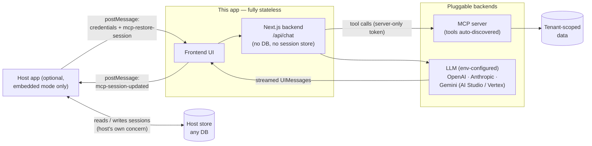

# Architecture overview

*A 2-minute read. For setup and configuration, start at the [README](../README.md).*

## What it is

A stateless Next.js chat app that lets end-users ask natural-language questions
about data exposed by an MCP server — built for [Nekt](https://nekt.ai) MCP
servers with per-tenant scoped tokens, but pointed at any MCP server by
changing a URL. It runs in two first-class modes: **standalone** (deploy as-is;
connect via the built-in form or env prefills) or **embedded as an iframe**
inside any host product, without forking.

## How it works

> **This app never touches a database — conversation history is the adopter's
> responsibility.** In embedded mode the host persists conversations via the
> postMessage contract and re-injects them; a standalone deployment has
> per-tab, in-memory history only unless the client builds persistence around
> `/api/chat`. Statelessness is what lets a single deployment serve any number
> of tenants.

Request flow:

1. The browser supplies the MCP server URL + per-tenant token — typed into the
   connect form (standalone) or injected by the host via `postMessage`
   (embedded, see [`iframe-message-contract.md`](iframe-message-contract.md)).
2. `/api/chat` opens a fresh MCP client with that token per request. The token
   stays server-side — it never reaches the LLM and is never persisted.
3. Tools are **discovered** from the MCP server at request time and handed to
   the model; the agentic loop (`streamText`, step-capped, final step forced
   to prose) iterates until it has an answer.
4. The answer streams back as a standard Vercel AI SDK UIMessage stream. In
   embedded mode the completed conversation is posted to the host to persist.

## Extension points

One codebase, swapped by config or thin adapters:

- **LLM provider** — OpenAI / Anthropic / Google AI Studio / Google Vertex,
  selected per deployment via `LLM_PROVIDER` / `LLM_MODEL` / `LLM_API_KEY`
  (`src/lib/models.ts`, documented in `.env.example`). No defaults — each
  deployment states its model and owns the bill. One deployment = one model.
- **Tool surface** — tools are discovered from the MCP server per request. New
  server capabilities light up automatically; pointing at a different MCP
  server is a URL change.
- **Tenant scoping** — per-tenant tokens arrive at runtime from the browser or
  host. Isolation is enforced at the MCP layer, not in app code; multi-tenant
  from day one with no per-tenant deployment.
- **Host surface** — anything that renders an iframe, integrated via the
  postMessage contract ([`embedding-guide.md`](embedding-guide.md)).
- **Session continuity** — conversations are addressable by `sessionId`, and
  the full message array (text + tool calls + reasoning) round-trips through
  `mcp-session-updated` / `mcp-restore-session`. Multi-session history,
  "resume", and "share thread" are host-side product features, not forks.

## Adoption tiers

The `/api/chat` backend is the reusable core — MCP plumbing, LLM routing, and
token-as-bearer security live there. The frontend is an example implementation
that adopters fully own. Lowest to highest effort:

1. **Standalone** — deploy as-is and use it directly. Zero integration.
2. **Iframe — any stack, zero code.** Anything that renders an `<iframe>`:
   React, Vue, Rails, plain HTML, low-code platforms, mobile webviews. The
   postMessage contract is the entire integration cost.
3. **React drop-in — small refactor.** Extract the `<Chat>` component from
   `src/app/page.tsx`, pass `url` / `token` / `sessionId` as props instead of
   postMessage, and mount it inline. Restyle freely.
4. **Bring your own UI.** Write a chat view in any stack and call `/api/chat`
   as an SSE endpoint. The Vercel AI SDK ships `@ai-sdk/vue`, `@ai-sdk/svelte`,
   and `@ai-sdk/angular` with the same `useChat` ergonomics; native mobile
   writes a thin SSE client over the documented UIMessage stream protocol.
